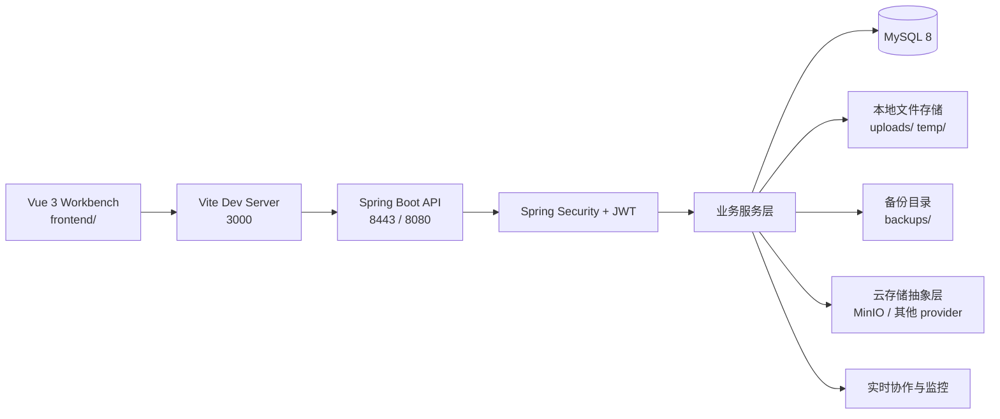

# File Sharing System

一个基于 `Spring Boot 2.7 + Vue 3 + Element Plus` 的文件共享工作台，覆盖认证鉴权、文件管理、短链分享、快传中心、协作项目、回收站、推荐、备份恢复、监控和云存储配置等能力。

当前仓库不是单一后端接口集合，而是一个已经具备完整工作台前端和多业务域后端的全栈项目。

## 项目概览

| 维度 | 当前实现 |
| --- | --- |
| 后端框架 | Spring Boot 2.7.5, Spring Security, Spring Data JPA, WebSocket |
| 前端框架 | Vue 3, Vite 5, TypeScript, Pinia, Vue Router, Element Plus |
| JDK | 17 |
| 数据库 | MySQL 8 |
| 默认后端端口 | `8443` HTTPS, `8080` HTTP 重定向 |
| 默认前端端口 | `3000` |
| 前端页面数 | 19 个 Vue 页面 |
| 主控制器数 | 18 个主控制器 + 1 个上传控制器 |
| 已扫描接口数 | 65 |
| 默认存储后端 | 本地存储 `storage.type=local` |

## 这套系统现在能做什么

### 1. 文件工作台

- 用户注册、登录、JWT 鉴权
- 文件上传、下载、预览、重命名、移动、复制、收藏
- 文件夹创建、浏览、重命名、删除
- 分片上传、断点续传、上传校验
- 公开文件接口和用户个人文件统计

### 2. 快传中心

- 文本快传
- 文件快传
- 预签名直传
- 取件码提取与下载授权
- 快传配置管理
- 快传记录审计与导出
- 兼容旧版 `/api/share/*`、`/api/admin/*` 风格接口

### 3. 分享与外链访问

- 创建短链分享
- 分享密码访问
- 一次性下载令牌
- 我的分享列表、启用、停用、删除
- 公共访问页 `/s/:shareKey`

### 4. 检索、推荐与回收站

- 文件搜索、建议词、热词、搜索历史
- 智能推荐生成、查看、采纳、分析
- 回收站查询、恢复、批量恢复、永久删除、过期清理

### 5. 备份、监控与协作

- 全量备份、增量备份、异步备份任务
- 备份校验、恢复、统计、配置导入导出
- 系统指标、健康检查、告警、性能报告
- 协作项目、成员、文档、评论
- 实时协作会话、同步、在线协作者、聊天

### 6. 云存储与兼容接口

- 云存储配置管理、能力查询、异步探测、连接测试
- 默认配置/启用配置查询
- 保留 legacy 兼容控制器，适合旧前端或旧客户端迁移

## 前后端模块对照

| 模块 | 前端页面 / 路由 | 后端入口 |
| --- | --- | --- |
| 认证 | `/login`, `/register` | `/api/auth/**`, `/api/users/**` |
| 仪表盘 | `/dashboard` | 多模块聚合 |
| 文件管理 | `/dashboard/files` | `/api/files/**`, `/api/folders/**`, `/api/upload/**`, `/api/preview/**` |
| 快传中心 | `/dashboard/quick-transfer` | `/api/public/**`, `/api/admin/quick-transfer/**`, `/api/admin/fcb/**` |
| 发件工作台 | `/dashboard/quick-transfer/share` | `/api/public/share/**`, `/api/public/presign/**` |
| 取件空间 | `/dashboard/pickup-space` | `/api/public/share/select`, `/api/public/share/download` |
| 分享管理 | `/dashboard/shares` | `/api/shares/**` |
| 外链访问 | `/s/:shareKey` | `/api/shares/public/**` |
| 搜索 | `/dashboard/search` | `/api/search/**` |
| 推荐 | `/dashboard/recommendations` | `/api/recommendations/**` |
| 回收站 | `/dashboard/recycle-bin` | `/api/recycle-bin/**` |
| 备份 | `/dashboard/backup` | `/api/backup/**` |
| 协作项目 | `/dashboard/collaboration` | `/api/collaboration/projects/**` |
| 协作工作区 | `/dashboard/collaboration/:projectId` | `/api/collaboration/**`, WebSocket / realtime API |
| 个人中心 | `/dashboard/profile` | `/api/users/profile`, `/api/users/change-password` |

## 架构速览



## 技术栈

### 后端

- Java 17
- Spring Boot 2.7.5
- Spring MVC
- Spring Security
- Spring Data JPA
- MySQL 8
- WebSocket
- Jackson
- JJWT
- Apache Tika
- Thumbnailator
- Actuator + Micrometer
- MinIO SDK

### 前端

- Vue 3
- TypeScript
- Vite 5
- Vue Router 4
- Pinia
- Element Plus
- Axios
- QRCode

## 仓库结构

```text
.
├─ src/main/java/com/filesharing/
│  ├─ controller/           # 主业务控制器
│  ├─ upload/               # 分片上传控制器
│  ├─ service/              # 服务接口
│  ├─ service/impl/         # 服务实现
│  ├─ repository/           # JPA 仓储
│  ├─ entity/               # 数据实体
│  ├─ dto/                  # 请求与响应对象
│  ├─ config/               # 安全、HTTPS、WebSocket、定时任务配置
│  ├─ backup/               # 备份与恢复实现
│  ├─ monitoring/           # 监控能力
│  └─ websocket/            # 协作 WebSocket
├─ src/main/resources/
│  ├─ application.yml       # 主配置
│  └─ certs/keystore.p12    # 默认 HTTPS 证书
├─ frontend/
│  ├─ src/layouts/          # 主布局
│  ├─ src/pages/            # 19 个页面
│  ├─ src/stores/           # Pinia 状态
│  ├─ src/services/         # 前端 API 封装
│  └─ vite.config.ts        # 本地开发代理配置
├─ scripts/                 # 冒烟与迁移脚本
├─ api_endpoints.*          # 接口清单
├─ api_inventory_readme.md  # 扫描结果摘要
└─ postman_collection.json  # Postman 集合
```

## 快速启动

### 1. 环境准备

- JDK 17+
- Maven 3.6+
- Node.js 18+
- MySQL 8+

### 2. 初始化数据库

默认数据库配置来自 [application.yml](./src/main/resources/application.yml)：

- 数据库：`filesharing`
- 用户名：`root`
- 密码：`123456`

可选初始化方式：

- 执行 `init_mysql.ps1`
- 执行 `init_mysql.bat`
- 手动导入 `setup_mysql.sql`
- 手动导入 `database_setup.sql`

### 3. 启动后端

推荐直接按仓库当前配置启动，保持 HTTPS 默认开启：

```powershell
mvn clean spring-boot:run
```

当前默认行为：

- HTTPS 监听 `8443`
- HTTP 监听 `8080`
- `8080` 会重定向到 `8443`
- 默认证书位于 `src/main/resources/certs/keystore.p12`

健康检查可用：

```powershell
curl.exe -k https://localhost:8443/api/files/public
```

如果你想临时关闭 HTTPS，用纯 HTTP 跑本地开发：

```powershell
mvn spring-boot:run "-Dspring-boot.run.arguments=--server.ssl.enabled=false --server.port=8080"
```

注意：如果你切到纯 HTTP，需要同时调整前端代理目标。

### 4. 启动前端

```powershell
cd frontend
npm install
npm run dev
```

前端默认运行在 `http://localhost:3000`，并通过 [frontend/vite.config.ts](./frontend/vite.config.ts) 把 `/api` 代理到：

```text
https://localhost:8443
```

当前代理已设置：

- `changeOrigin: true`
- `secure: false`

这意味着本地自签名证书可以直接联调。

### 5. 构建前端

```powershell
cd frontend
npm run type-check
npm run build
```

### 6. Docker 一键启动（前端 + 后端 + MySQL + MinIO）

仓库根目录已提供：

- `Dockerfile`：后端镜像构建
- `docker-compose.yml`：MySQL、MinIO、MinIO 初始化、后端编排
- `docker/minio/minio-init.sh`：自动创建 `filesharing` bucket
- `frontend/Dockerfile`：前端镜像构建
- `frontend/nginx.conf`：前端静态服务与 `/api` 反向代理

启动命令：

```powershell
docker compose up -d --build
```

查看初始化与后端日志：

```powershell
docker compose logs -f minio-init backend
```

启动后默认访问：

- 前端工作台：`http://localhost:3000`
- 后端 API：`http://localhost:8080`
- MinIO API：`http://localhost:9000`
- MinIO Console：`http://localhost:9001`
- MinIO 默认账号：`minioadmin / minioadmin`

当前 compose 会为后端注入以下关键参数：

- `STORAGE_TYPE=minio`
- `STORAGE_MINIO_ENDPOINT=http://minio:9000`
- `STORAGE_MINIO_BUCKET=filesharing`
- MySQL 连接信息（容器内主机名 `mysql`）

前端容器通过 Nginx 将 `/api/*` 转发到 `backend:8080`，浏览器侧无需额外配置 API 地址。

停止并清理：

```powershell
docker compose down
```

## 配置说明

### 当前 `application.yml` 里的关键配置

| 配置项 | 当前值 / 默认行为 | 说明 |
| --- | --- | --- |
| `server.port` | `8443` | HTTPS 端口 |
| `server.http.port` | `8080` | HTTP 端口，开启 SSL 时用于跳转 |
| `server.ssl.enabled` | `true` | 当前仓库默认启用 HTTPS |
| `spring.datasource.url` | `jdbc:mysql://localhost:3306/filesharing...` | MySQL 连接 |
| `file.upload.path` | `./uploads/` | 文件正式存储目录 |
| `file.upload.temp-path` | `./temp/` | 分片与临时文件目录 |
| `file.upload.max-size` | `100MB` | Spring Multipart 限制 |
| `storage.type` | `local` | 存储后端，支持切换 |
| `storage.minio.*` | 已提供示例 | MinIO 接入参数 |
| `upload.chunk.max-size` | `5MB` | 单分片最大大小 |
| `upload.file.max-size` | `10GB` | 单文件上传上限 |
| `jwt.expiration` | `86400000` | JWT 有效期 24 小时 |
| `fcb.open-upload` | `true` | 快传是否允许游客上传 |
| `fcb.upload-size` | `10MB` | 快传单文件上限 |
| `fcb.presign-expire-seconds` | `900` | 直传会话有效期 |
| `fcb.download-token-ttl-seconds` | `600` | 取件下载令牌有效期 |
| `geoip.service-url` | `https://ipwho.is/{ip}` | 访问地址解析 |

### 备份配置的一个代码细节

`DataBackupService` 还支持以下配置项：

- `backup.base-path`
- `backup.max-size`
- `backup.compression-level`

这几个配置当前没有直接写在 `application.yml` 中，但服务代码里已经实现了默认值回退：

- `backup.base-path` 默认 `./backups`
- `backup.max-size` 默认 `10737418240`
- `backup.compression-level` 默认 `6`

如果你要定制备份目录或压缩级别，可以直接把这些键补进配置文件。

## 认证与安全

### 鉴权方式

- 绝大多数业务接口使用 JWT
- 认证头格式：

```text
Authorization: Bearer <token>
```

### 公开接口范围

根据 [SecurityConfig.java](./src/main/java/com/filesharing/config/SecurityConfig.java)，当前公开访问包括：

- `/api/auth/**`
- `/api/files/public/**`
- `/api/shares/public/**`
- `/api/public/**`
- `/api/share/**`
- `/api/chunk/**`
- `/api/presign/**`
- `/api/admin/login`
- `/s/**`
- `/api/health`

### 当前安全实现特点

- `SessionCreationPolicy.STATELESS`
- JWT 过滤器已启用
- CORS 允许所有来源
- H2 Console 放行

## API 模块总览

仓库里有自动扫描产物 [api_inventory_readme.md](./api_inventory_readme.md)，当前记录：

- 已扫描接口总数：`65`
- 双通道可达接口：`65/65`

### 主要 API 域

| 域 | 基础路径 | 说明 |
| --- | --- | --- |
| 认证 | `/api/auth` | 注册、登录、获取当前用户 |
| 用户 | `/api/users` | 个人资料、修改密码 |
| 文件 | `/api/files` | 文件 CRUD、预览、收藏、统计 |
| 文件夹 | `/api/folders` | 文件夹 CRUD 与内容查询 |
| 上传 | `/api/upload` | 分片上传初始化、上传、合并完成 |
| 快传公开接口 | `/api/public` | 文本/文件快传、取件、预签名直传 |
| 快传管理 | `/api/admin/quick-transfer`, `/api/admin/fcb` | 配置、记录、导出 |
| 分享 | `/api/shares` | 创建分享、我的分享、公开访问 |
| 搜索 | `/api/search` | 搜索、建议、热词、历史、统计 |
| 回收站 | `/api/recycle-bin` | 查询、恢复、清空、过期处理 |
| 推荐 | `/api/recommendations` | 生成、查看、采纳、分析 |
| 备份 | `/api/backup` | 全量、增量、异步、校验、恢复 |
| 协作 | `/api/collaboration` | 项目、成员、文档、评论、实时 |
| 监控 | `/api/monitoring` | 健康、指标、告警、报告 |
| 云存储 | `/api/cloud-storage` | 能力、配置、探测、测试连接 |
| 预览 | `/api/preview` | 文件内容、图片、PDF、文本统计 |
| 兼容接口 | `/api/admin`, `/api/share`, `/api/chunk`, `/api/presign` | 旧客户端兼容 |

## 前端工作台页面

前端路由来自 [frontend/src/router/index.ts](./frontend/src/router/index.ts)。

### 已实现页面

| 路由 | 页面 |
| --- | --- |
| `/dashboard` | 工作台总览 |
| `/dashboard/files` | 文件管理 |
| `/dashboard/preview/:id` | 文件预览 |
| `/dashboard/quick-transfer` | 快传中心 |
| `/dashboard/quick-transfer/share` | 快传工作台 |
| `/dashboard/quick-transfer/config` | 快传配置 |
| `/dashboard/quick-transfer/records` | 快传记录 |
| `/dashboard/pickup-space` | 取件空间 |
| `/dashboard/search` | 搜索 |
| `/dashboard/shares` | 分享管理 |
| `/dashboard/recycle-bin` | 回收站 |
| `/dashboard/recommendations` | 智能推荐 |
| `/dashboard/backup` | 备份 |
| `/dashboard/collaboration` | 协作项目 |
| `/dashboard/collaboration/:projectId` | 协作工作区 |
| `/dashboard/profile` | 个人中心 |
| `/s/:shareKey` | 外链访问页 |

## 典型开发命令

### 后端

```powershell
mvn clean compile
mvn test
mvn spring-boot:run
```

### 前端

```powershell
cd frontend
npm install
npm run dev
npm run type-check
npm run build
```

## 仓库内可直接使用的辅助资产

### 接口资产

- [api_endpoints.md](./api_endpoints.md)
- [api_endpoints.json](./api_endpoints.json)
- [api_endpoints.tsv](./api_endpoints.tsv)
- [api_inventory_readme.md](./api_inventory_readme.md)
- [postman_collection.json](./postman_collection.json)

### 脚本

- `api-test.ps1`
- `comprehensive_api_test.ps1`
- `scripts/api_smoke_test.ps1`
- `init_mysql.ps1`
- `init_mysql.bat`
- `manual-start.bat`
- `diagnostic.bat`
- `verify_database.bat`

## 代码分析后需要你注意的几点

### 1. README 不能再写成“默认 8080 + Swagger 可直接访问”

当前代码实际情况是：

- 后端默认 HTTPS 端口是 `8443`
- `8080` 是 HTTP 跳转端口
- 仓库确实引入了 `springdoc-openapi-ui`
- 但安全配置里 Swagger 放行规则仍是注释状态
- 主启动类打印的 `http://localhost:8080/api/swagger-ui/` 更像历史遗留提示，不应当作为当前文档依据

### 2. 云存储模块已经成型，但实现里有简化逻辑

[CloudStorageServiceImpl.java](./src/main/java/com/filesharing/service/impl/CloudStorageServiceImpl.java) 中：

- 配置管理、默认配置切换、启用配置查询是完整的
- 但部分上传 / 签名 URL / provider 行为仍是简化实现
- 示例中能看到 `http://example.com/...` 这类占位返回

结论：

- 可以把它当成“云存储抽象层与配置中心”
- 如果要生产落地，必须逐 provider 验证真实 SDK 行为

### 3. 备份系统是真实业务，不是占位接口

[DataBackupService.java](./src/main/java/com/filesharing/backup/DataBackupService.java) 已经实现了：

- 全量备份
- 增量备份
- 异步任务持久化
- 数据库导出
- 文件归档 ZIP
- SHA-256 校验
- 恢复与清理

这部分在 README 中应按真实能力描述，而不是一句“支持备份”带过。

### 4. 快传中心是独立业务域，不是普通分享的皮肤

[FileCodeBoxService.java](./src/main/java/com/filesharing/service/FileCodeBoxService.java) 显示当前快传具备：

- 文本快传
- 文件快传
- 预签名上传
- 取件码
- 下载授权
- 频率限制
- 游客上传开关

因此文档中应把“快传”单列，而不是混在“文件分享”里。

### 5. 当前仓库默认凭据都是开发态

直接写在配置里的内容包括：

- MySQL `root / 123456`
- HTTPS keystore password `changeit`
- JWT secret 固定值

这些适合本地开发，不适合直接用于生产环境。

## 常见问题

### 1. 前端能打开，接口全红

先检查两件事：

- 后端是否真的跑在 `https://localhost:8443`
- 前端代理是否仍指向 `https://localhost:8443`

### 2. 本地证书报错

当前前端代理已配置 `secure: false`。如果你用 `curl` 或浏览器直接访问接口，需要接受或跳过本地自签名证书校验。

### 3. 分片上传报 401

`/api/upload/chunk/*` 当前要求用户已认证，不是游客接口。

### 4. 快传能发不能取

优先检查：

- `fcb.open-upload`
- 取件码是否过期
- 错误次数是否触发风控窗口

### 5. 备份配置不生效

先确认你修改的是：

- `application.yml` 中实际存在的键
- 或者你已经补充了 `backup.base-path` / `backup.max-size` / `backup.compression-level`

## 适合继续补强的方向

- 给云存储模块补齐真实 provider SDK 行为
- 把 Swagger/OpenAPI 的暴露策略和 README 对齐
- 为协作、备份、快传分别补更完整的集成测试
- 为生产环境提供 `.env` / profile 分层配置
- 收敛默认密钥、数据库密码和证书密码

## 结论

如果你的目标是：

- 本地快速跑起来
- 有一个完整的文件共享与协作工作台
- 能继续往企业内网文件平台方向扩展

那么这份仓库已经具备不错的基础。

如果你的目标是直接生产落地，则最需要优先核查的是：

- HTTPS / 证书 / 环境变量管理
- 云存储 provider 的真实上传链路
- 安全默认值
- 各业务域的集成测试覆盖
