# 数据库表实体图

本文档用于补充 [数据库表结构与ER图.md](数据库表结构与ER图.md) 和 [数据库表属性图.md](数据库表属性图.md)。这里采用“中心表名 + 周围字段”的方式，尽量贴近你给出的示意图风格。由于表数量较多，下面每张图只展示核心字段，完整字段说明仍建议以字段字典为准。

## 1. 用户与文件核心表

### users 用户表

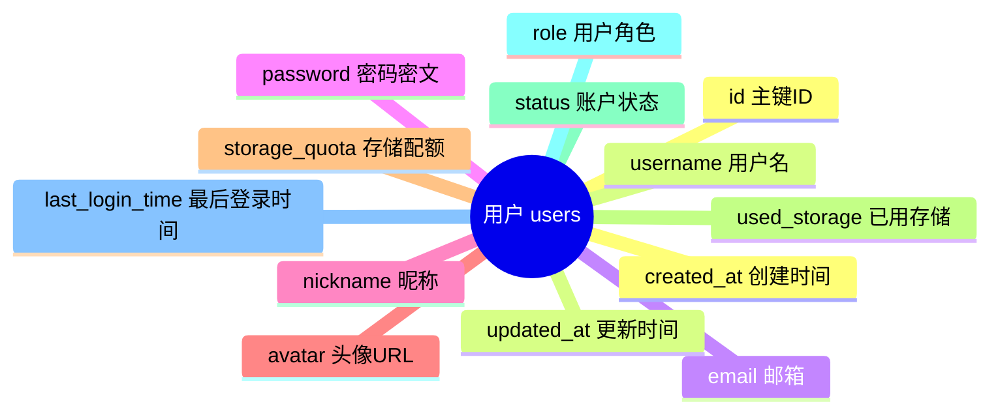

### folders 文件夹表

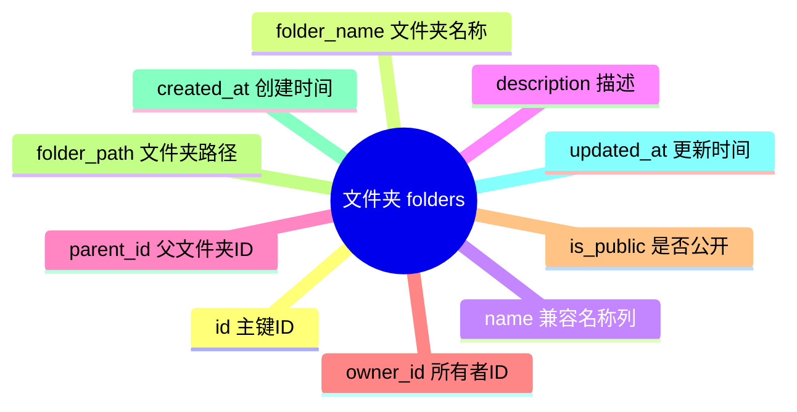

### files 文件表

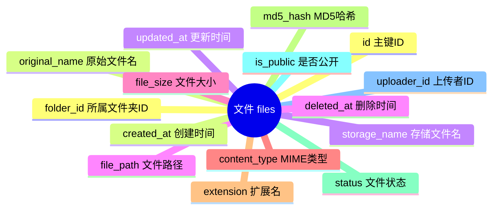

### file_versions 文件版本表

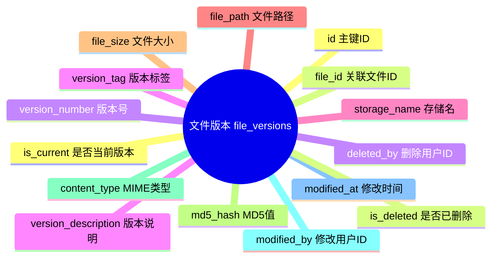

### file_statistics 文件统计表

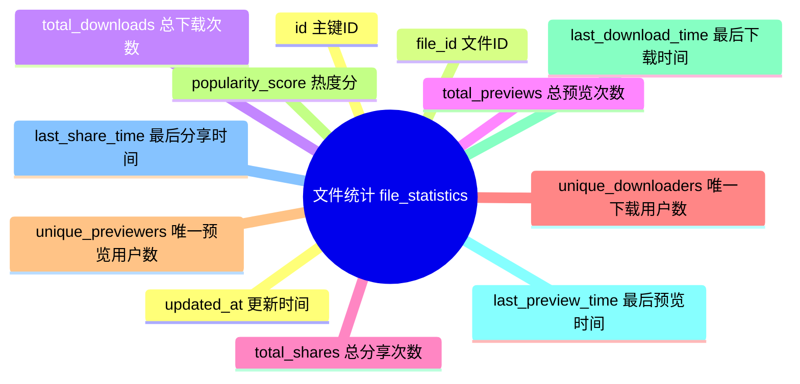

## 2. 标签与缩略图表

### tags 标签表

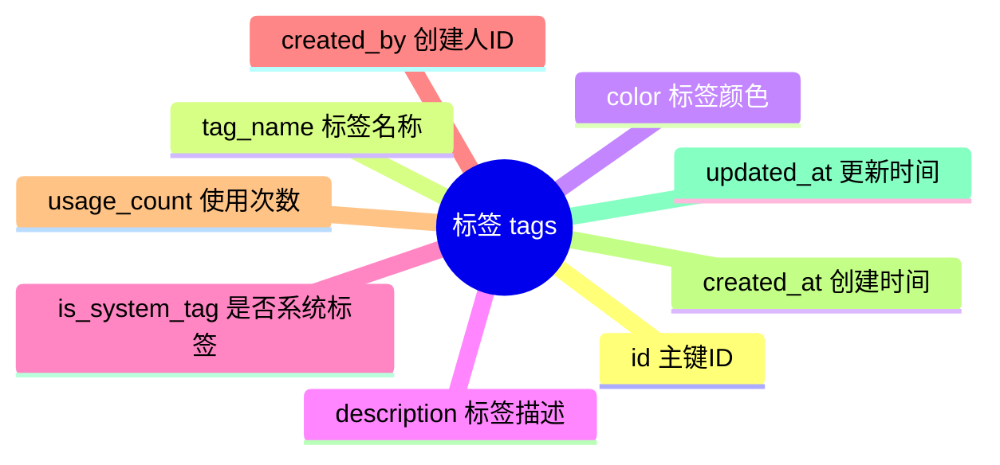

### file_tags 文件标签关联表

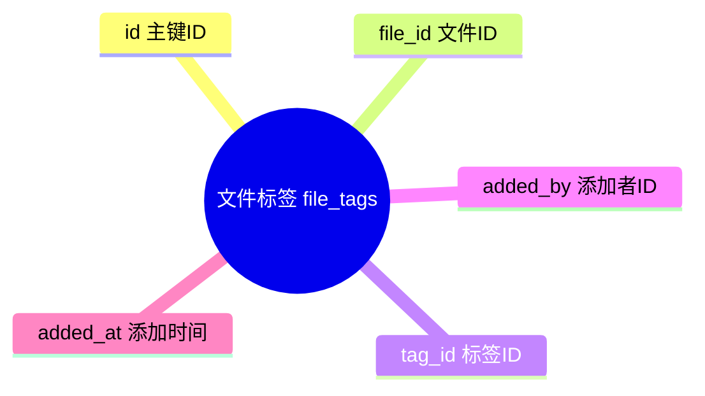

### folder_tags 文件夹标签关联表

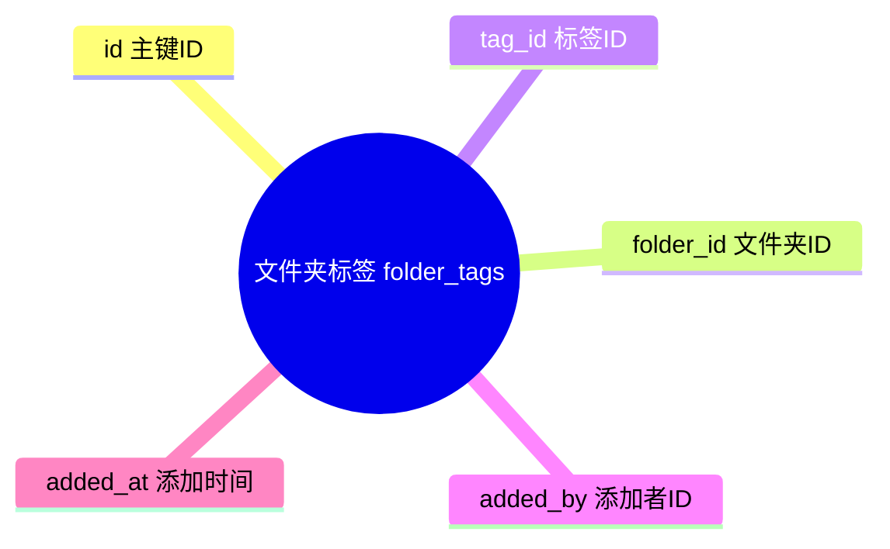

### thumbnails 缩略图表

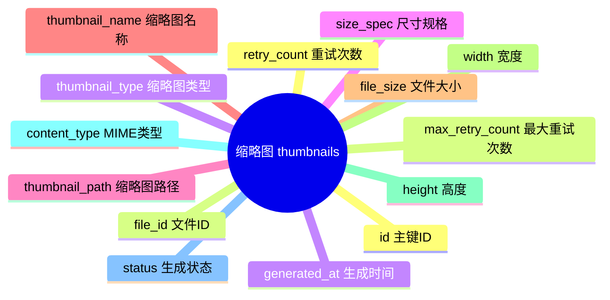

## 3. 分享与快传表

### share_records 分享记录表

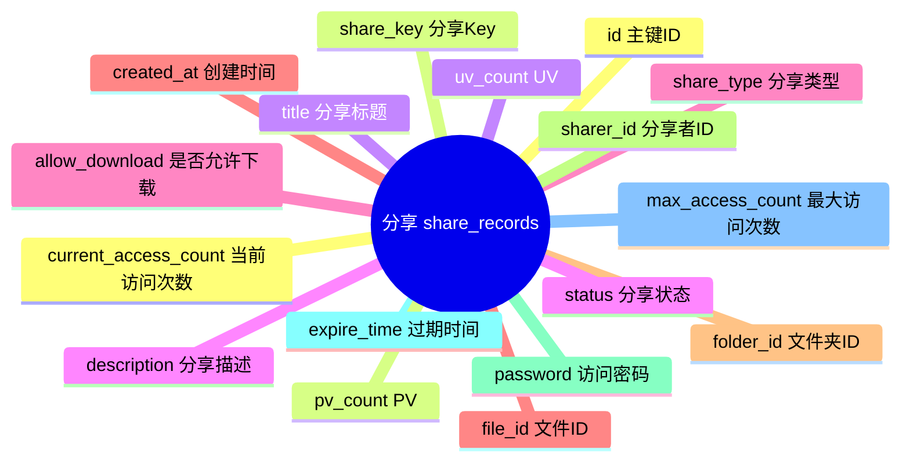

### share_click_logs 分享点击日志表

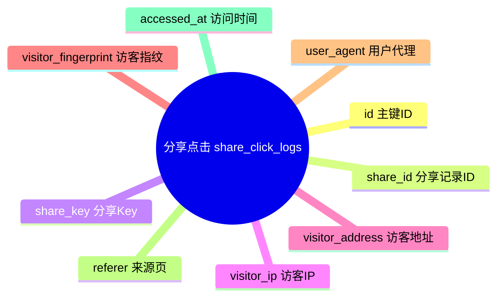

### pickup_code_records 取件码表

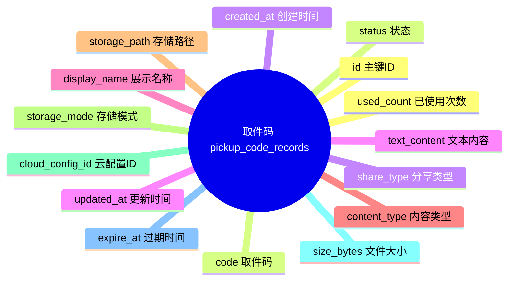

### shares 旧版分享表

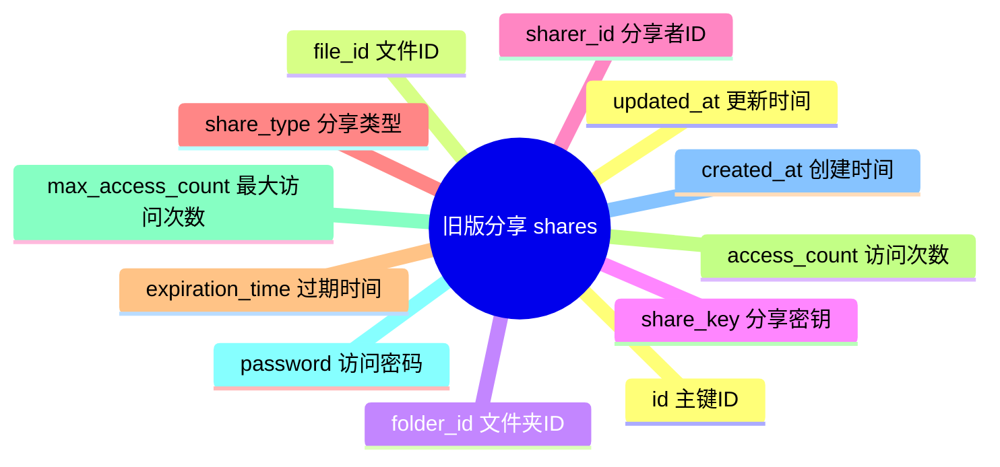

## 4. 协作与内容表

### collaboration_projects 协作项目表

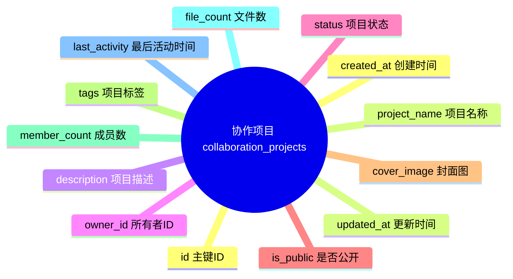

### project_members 项目成员表

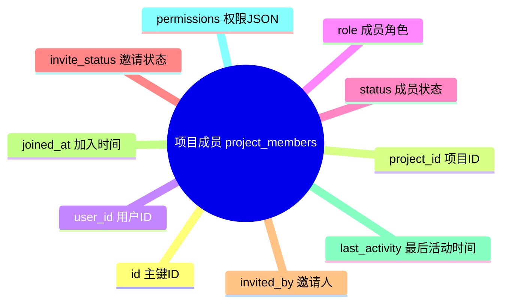

### collaborative_documents 协作文档表

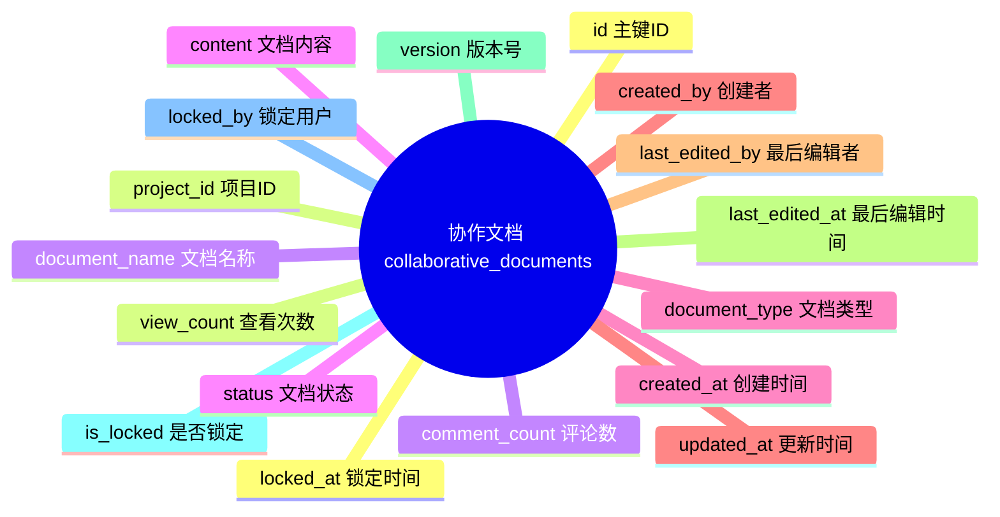

### collaborative_document_snapshots 协作文档快照表

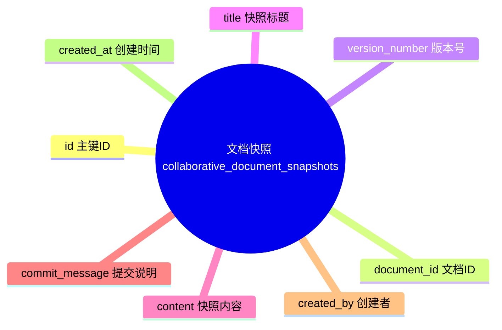

### document_blocks 文档块表

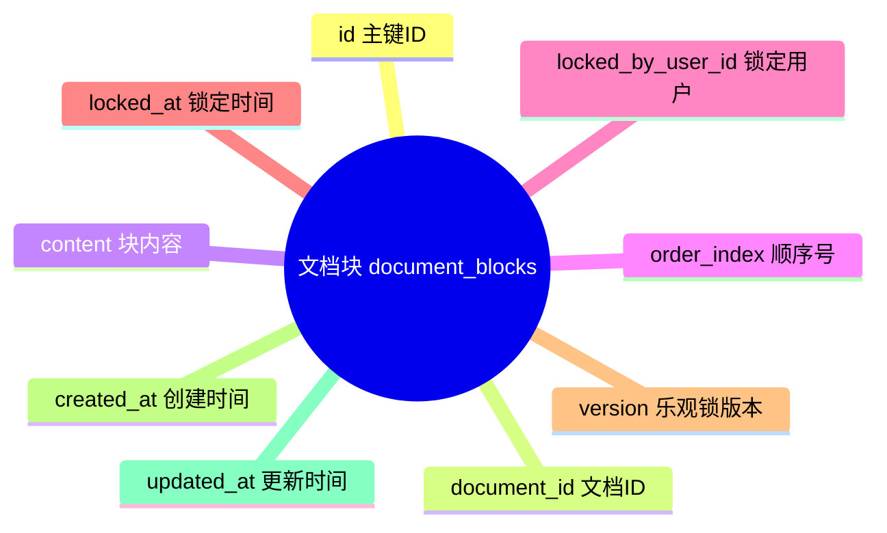

### comments 评论表

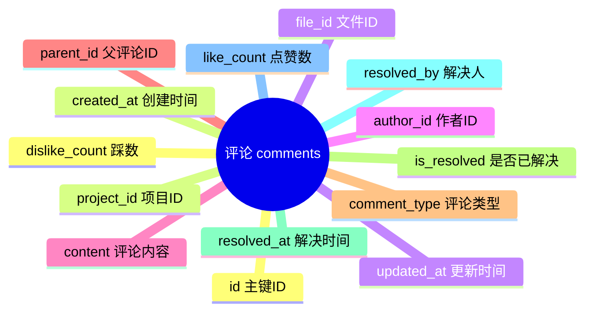

### document_editors 文档编辑者连接表

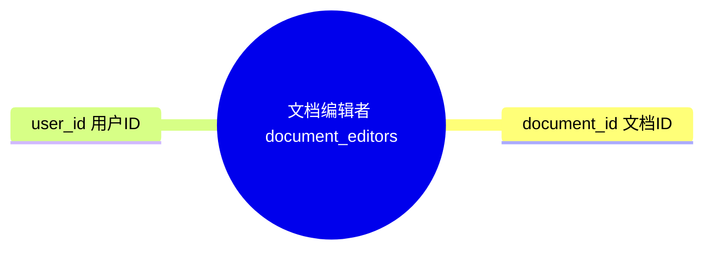

### document_tags 文档标签表

```mermaid
mindmap
  root((文档标签 document_tags))
    document_id 文档ID
    tag 标签文本
```

## 5. 上传、运维与统计表

### chunk_upload_records 分片上传记录表

```mermaid
mindmap
  root((分片上传 chunk_upload_records))
    id 主键ID
    upload_id 上传会话ID
    original_name 原始文件名
    file_size 文件总大小
    chunk_size 分片大小
    total_chunks 总分片数
    uploaded_chunks 已上传分片数
    status 上传状态
    uploader_id 上传者ID
    folder_id 目标文件夹ID
    md5_hash MD5哈希
    expire_time 过期时间
    created_at 创建时间
    updated_at 更新时间
```

### operation_logs 操作日志表

```mermaid
mindmap
  root((操作日志 operation_logs))
    id 主键ID
    operation_type 操作类型
    description 操作描述
    user_id 用户ID
    file_id 文件ID
    folder_id 文件夹ID
    share_id 分享ID
    ip_address IP地址
    user_agent 用户代理
    result 操作结果
    error_message 错误信息
    operation_time 操作时间
```

### notifications 通知表

```mermaid
mindmap
  root((通知 notifications))
    id 主键ID
    user_id 接收者ID
    title 标题
    content 内容
    notification_type 通知类型
    priority 优先级
    related_file_id 关联文件ID
    related_share_id 关联分享ID
    related_folder_id 关联文件夹ID
    is_read 是否已读
    is_sent 是否已发送
    send_channel 发送渠道
    sent_time 发送时间
    read_time 阅读时间
    expire_time 失效时间
    retry_count 重试次数
    max_retry_count 最大重试次数
    send_result 发送结果
    created_at 创建时间
    updated_at 更新时间
```

### notification_templates 通知模板表

```mermaid
mindmap
  root((通知模板 notification_templates))
    id 主键ID
    template_name 模板名称
    title_template 标题模板
    content_template 内容模板
    notification_type 通知类型
    is_enabled 是否启用
    supported_channels 支持渠道
    variables_description 变量说明
    created_by 创建人
    version 版本号
    created_at 创建时间
    updated_at 更新时间
```

### preview_records 预览记录表

```mermaid
mindmap
  root((预览记录 preview_records))
    id 主键ID
    file_id 文件ID
    user_id 用户ID
    preview_type 预览类型
    device_type 设备类型
    user_agent 用户代理
    ip_address IP地址
    duration_seconds 预览时长
    is_success 是否成功
    error_message 错误信息
    preview_time 预览时间
```

### search_records 搜索记录表

```mermaid
mindmap
  root((搜索记录 search_records))
    id 主键ID
    search_keyword 搜索关键词
    user_id 用户ID
    search_type 搜索类型
    result_count 结果数量
    search_duration 搜索耗时
    has_filters 是否有筛选条件
    filter_conditions 筛选条件JSON
    search_time 搜索时间
    client_ip 客户端IP
    user_agent 用户代理
```

### recycle_bin 回收站表

```mermaid
mindmap
  root((回收站 recycle_bin))
    id 主键ID
    item_id 被删项目ID
    item_type 项目类型
    original_name 原始名称
    original_path 原始路径
    original_parent_id 原始父级ID
    file_size 文件大小
    file_type 文件类型
    deleted_by 删除用户
    deleted_at 删除时间
    expire_at 过期时间
    is_recoverable 是否可恢复
    restore_target_id 恢复目标ID
    delete_reason 删除原因
    created_at 创建时间
```

### batch_operations 批量操作表

```mermaid
mindmap
  root((批量操作 batch_operations))
    id 主键ID
    operation_type 操作类型
    status 操作状态
    user_id 执行用户ID
    description 描述
    operation_params 操作参数JSON
    total_items 总项目数
    processed_items 已处理数
    success_items 成功数
    failed_items 失败数
    progress_percentage 进度
    is_cancellable 是否可取消
    started_at 开始时间
    completed_at 完成时间
    estimated_completion 预计完成时间
    created_at 创建时间
    updated_at 更新时间
```

### batch_operation_details 批量操作详情表

```mermaid
mindmap
  root((批量详情 batch_operation_details))
    id 主键ID
    batch_operation_id 批量操作ID
    item_id 项目ID
    item_type 项目类型
    item_name 项目名称
    item_status 处理状态
    result_message 结果消息
    error_message 错误信息
    started_at 开始时间
    completed_at 完成时间
    processing_time 处理耗时
    created_at 创建时间
```

### user_behavior_stats 用户行为统计表

```mermaid
mindmap
  root((用户行为统计 user_behavior_stats))
    id 主键ID
    user_id 用户ID
    total_uploads 总上传数
    total_downloads 总下载数
    total_previews 总预览数
    total_folders_created 总建文件夹数
    total_shares 总分享数
    total_storage_used 总使用量
    average_file_size 平均文件大小
    favorite_file_type 常用类型
    active_days 活跃天数
    last_active_time 最后活跃时间
    first_active_time 首次活跃时间
    user_level 用户等级
    user_points 用户积分
    period_start 周期开始
    period_end 周期结束
```

### system_configs 系统配置表

```mermaid
mindmap
  root((系统配置 system_configs))
    id 主键ID
    config_key 配置键
    config_value 配置值
    description 配置描述
    config_type 配置类型
    is_enabled 是否启用
    created_at 创建时间
    updated_at 更新时间
```

### system_statistics 系统统计表

```mermaid
mindmap
  root((系统统计 system_statistics))
    id 主键ID
    stat_date 统计日期
    total_users 总用户数
    new_users 新增用户数
    active_users 活跃用户数
    total_files 总文件数
    new_files 新增文件数
    total_folders 总文件夹数
    total_storage_used 总使用量
    total_storage_quota 总配额
    total_downloads 总下载数
    total_previews 总预览数
    total_shares 总分享数
    average_file_size 平均文件大小
    system_load 系统负载
    cpu_usage CPU使用率
    memory_usage 内存使用率
    disk_usage 磁盘使用率
    network_traffic 网络流量
    error_requests 错误请求数
    success_requests 成功请求数
    avg_response_time 平均响应时间
    created_at 创建时间
```

### smart_recommendations 智能推荐表

```mermaid
mindmap
  root((智能推荐 smart_recommendations))
    id 主键ID
    user_id 用户ID
    recommendation_type 推荐类型
    item_id 推荐项ID
    reason 推荐理由
    relevance_score 相关度
    source_type 来源类型
    source_model_id 来源模型ID
    is_viewed 是否查看
    is_adopted 是否采纳
    viewed_at 查看时间
    adopted_at 采纳时间
    created_at 创建时间
    expire_at 过期时间
```

### cloud_storage_configs 云存储配置表

```mermaid
mindmap
  root((云存储配置 cloud_storage_configs))
    id 主键ID
    config_name 配置名称
    provider_type 服务商类型
    access_key_id AccessKey
    access_key_secret Secret
    bucket_name 桶名
    region 区域
    custom_domain 自定义域名
    endpoint 端点
    base_path 基础路径
    is_enabled 是否启用
    is_default 是否默认
    storage_limit 容量限制
    used_storage 已用容量
    file_size_limit 文件大小限制
    allowed_file_types 允许类型
    connection_status 连接状态
    last_test_time 最后测试时间
    test_result 测试结果
    created_at 创建时间
    updated_at 更新时间
```

### cloud_file_mappings 云文件映射表

```mermaid
mindmap
  root((云文件映射 cloud_file_mappings))
    id 主键ID
    local_file_id 本地文件ID
    storage_config_id 存储配置ID
    cloud_key 云端Key
    cloud_url 云端URL
    etag ETag
    version_id 版本ID
    storage_class 存储类型
    is_uploaded 是否已上传
    uploaded_at 上传时间
    upload_attempts 上传次数
    max_retry_attempts 最大重试次数
    upload_error 上传错误
    cdn_enabled 是否启用CDN
    cdn_url CDN地址
    lifecycle_status 生命周期状态
    created_at 创建时间
```

### backup_task 备份任务表

```mermaid
mindmap
  root((备份任务 backup_task))
    task_id 任务ID
    backup_name 备份名称
    backup_type 备份类型
    status 任务状态
    start_time 开始时间
    end_time 结束时间
    success 是否成功
    error_message 错误信息
    db_backup_path 数据库备份路径
    files_backup_path 文件备份路径
    metadata_path 元数据路径
    backed_up_file_count 备份文件数
```

## 6. 说明

1. 这些实体图更适合论文、答辩材料和功能说明文档，展示方式接近你给出的示意图。
2. 如果你要，我可以继续把这些图拆成“每个模块一页”的排版版式，或者直接生成适合放入 Word/Markdown 的论文正文段落。
3. 如果你希望完全统一风格，我也可以把 [数据库表属性图.md](数据库表属性图.md) 和本文件统一改成相同的“实体图 + 字段字典”结构。
